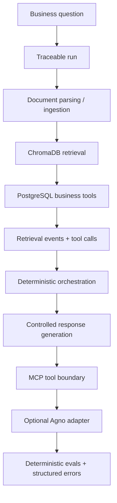

# Signal Layer Agentic RAG Workbench

A trace-first agentic RAG workbench for business data, documents, parsing,
retrieval, deterministic tools, orchestration, controlled response generation,
MCP tool exposure, deterministic evals, production hardening, and an optional
Agno agent adapter.

## What this is

This project is a local engineering workbench for building and inspecting
traceable AI-assisted workflows without hiding the execution path.

It combines:

* document parsing and ingestion
* vector retrieval over document chunks
* deterministic business data tools
* traceable orchestration
* controlled response generation
* local MCP tool exposure
* deterministic evals
* production-hardening primitives such as budgets, timing, and structured
  errors

The current implementation stores business records and audit events in
PostgreSQL and document chunks in ChromaDB.

## Why this exists

Most AI demos stop at:

```text
prompt → response
```

This project explores a more production-oriented pattern:

```text
business question
→ traceable run
→ document retrieval
→ structured data tools
→ audit events
→ deterministic orchestration
→ future agent response
```

The goal is to make agentic systems easier to inspect, test, and extend before
adding broader autonomy or real external provider execution.

## Current capabilities

* FastAPI service layer with validated request and response schemas
* Raw-text and file-based document ingestion
* Parsing support for `.txt`, `.md`, and `.markdown`
* Reserved optional `.pdf` parser path with clear failure behavior until wired
* ChromaDB-backed document search and run-linked retrieval
* PostgreSQL-backed business tools for customer and sales queries
* Deterministic orchestration through `POST /agent/run`
* Controlled response generation through `generate_response=true`
* Provider abstraction with deterministic mock behavior by default
* Local stdio MCP server foundation with approved tool wrappers
* Deterministic eval runner through `POST /evals/run` and `scripts/run_evals.py`
* Structured operational hardening with budgets, timing, and normalized errors
* Optional Agno adapter path through `POST /agent/agno/run`

## Architecture diagram



For a deeper breakdown of system boundaries and flows, see
[docs/architecture.md](docs/architecture.md).

## Stack

* Python 3.12+
* FastAPI and Pydantic
* PostgreSQL 16
* ChromaDB
* SQLAlchemy 2
* Docker and Docker Compose
* pytest, ruff, and mypy

## Quickstart

Create a virtual environment and install the project:

```bash
python3.12 -m venv .venv
source .venv/bin/activate
pip install -e ".[dev]"
cp .env.example .env
```

Start the local stack:

```bash
docker compose up --build
```

When running the API outside Docker, change the database host in `.env` from
`postgres` to `localhost`, then start the API:

```bash
uvicorn app.main:app --reload
```

OpenAPI documentation is available at `http://localhost:8000/docs`.

## Environment variables

* `DATABASE_URL`: SQLAlchemy connection URL for PostgreSQL.
* `APP_ENV`: runtime environment name.
* `LOG_LEVEL`: application logging level.
* `CHROMA_HOST`: ChromaDB host.
* `CHROMA_PORT`: ChromaDB port.
* `CHROMA_COLLECTION`: ChromaDB collection name for document chunks.
* `EMBEDDING_PROVIDER`: embedding provider name. The current implementation uses `mock`.
* `LLM_PROVIDER`: response-generation provider. Defaults to `mock`.
* `LLM_MODEL`: response-generation model name.
* `LLM_API_KEY`: optional shared API key field for provider setup.
* `OPENAI_API_KEY`: optional provider-specific API key.
* `GEMINI_API_KEY`: optional provider-specific API key.
* `DEEPSEEK_API_KEY`: optional provider-specific API key.
* `CHUNK_SIZE`: maximum chunk size for raw text ingestion.
* `CHUNK_OVERLAP`: overlap size between adjacent text chunks.
* `REQUEST_TIMEOUT_SECONDS`: request-level operational timeout budget.
* `TOOL_TIMEOUT_SECONDS`: per-tool operational timeout budget.
* `LLM_TIMEOUT_SECONDS`: response-generation timeout budget.
* `MAX_TOOL_CALLS_PER_RUN`: maximum allowed tool calls in one orchestration run.
* `MAX_RETRIEVAL_RESULTS`: maximum retrieval results returned by one query.
* `MAX_EVAL_CASES`: maximum eval cases allowed in one eval run.
* `AGNO_ENABLED`: enables the optional Agno agent adapter layer.
* `AGNO_MODEL`: configured model label for the Agno adapter path.
* `AGNO_ALLOW_REAL_PROVIDER`: keeps real model-backed Agno execution disabled by default.

## Demo scenario

The recommended local walkthrough is the “Commercial policy and online sales
review” scenario.

It demonstrates how to:

* parse and ingest a sample Markdown policy document
* search for discount approval rules
* run deterministic orchestration
* generate a controlled response from the trace
* run the optional Agno adapter path
* run deterministic evals
* inspect a structured error response

Start with the bundled sample file:

* [samples/commercial_policy.md](samples/commercial_policy.md)

For the client-facing walkthrough, see [docs/demo.md](docs/demo.md). For the
step-by-step command list, see [docs/demo-script.md](docs/demo-script.md).

### Demo quick flow

Parse and ingest the sample document:

```bash
curl -X POST http://localhost:8000/documents/parse-ingest \
  -F 'file=@samples/commercial_policy.md;type=text/markdown' \
  -F 'metadata={"department":"growth","document_type":"policy"}'
```

Search for the relevant policy rule:

```bash
curl -X POST http://localhost:8000/documents/search \
  -H "Content-Type: application/json" \
  -d '{
    "query":"discount approval rules",
    "limit":5,
    "where":{"department":"growth"}
  }'
```

Run deterministic orchestration:

```bash
curl -X POST http://localhost:8000/agent/run \
  -H "Content-Type: application/json" \
  -d '{
    "business_question":"Analyze online sales performance and find relevant commercial policy context.",
    "retrieval_query":"discount approval rules",
    "sales_region":"east",
    "sales_channel":"online",
    "customer_segment":"enterprise"
  }'
```

Run controlled response generation:

```bash
curl -X POST http://localhost:8000/agent/run \
  -H "Content-Type: application/json" \
  -d '{
    "business_question":"Analyze online sales performance and find relevant commercial policy context.",
    "retrieval_query":"discount approval rules",
    "sales_region":"east",
    "sales_channel":"online",
    "customer_segment":"enterprise",
    "generate_response":true
  }'
```

Run the optional Agno adapter path:

```bash
curl -X POST http://localhost:8000/agent/agno/run \
  -H "Content-Type: application/json" \
  -d '{
    "business_question":"Analyze online sales performance and retrieve relevant commercial policy context.",
    "retrieval_query":"discount approval rules",
    "sales_region":"east",
    "sales_channel":"online",
    "customer_segment":"enterprise",
    "generate_response":true,
    "use_agno_agent":true
  }'
```

Run the deterministic eval suite:

```bash
python scripts/run_evals.py
```

The built-in eval runner is intended for local and demo use. It ingests
built-in eval documents into the local retrieval/vector store.

Example structured error check:

```bash
curl -X POST http://localhost:8000/documents/search \
  -H "Content-Type: application/json" \
  -d '{"query":"discount approval rules","limit":20}'
```

## Document retrieval

Document parsing supports:

* `.txt`
* `.md`
* `.markdown`
* `.pdf` as an optional reserved Docling parser path

Uploaded files are parsed in memory and are not persisted in this phase.

Ingest raw text:

```bash
curl -X POST http://localhost:8000/documents/ingest \
  -H "Content-Type: application/json" \
  -d '{
    "title": "Commercial Policy",
    "source": "commercial_policy.md",
    "content": "Discount approval rules require manager review.",
    "metadata": {
      "department": "growth",
      "document_type": "policy"
    }
  }'
```

Search indexed chunks:

```bash
curl -X POST http://localhost:8000/documents/search \
  -H "Content-Type: application/json" \
  -d '{
    "query": "discount approval rules",
    "limit": 5,
    "where": {
      "department": "growth"
    }
  }'
```

Link retrieval to an existing run:

```bash
curl -X POST http://localhost:8000/runs/<run_id>/retrieve \
  -H "Content-Type: application/json" \
  -d '{
    "query": "What discount approval rules are relevant?",
    "limit": 5
  }'
```

When retrieval is linked to a run, the query, retrieved chunks, metadata, and
distances are recorded in PostgreSQL as a retrieval event.

Parse a document without ingesting it:

```bash
curl -X POST http://localhost:8000/documents/parse \
  -F 'file=@commercial_policy.md;type=text/markdown' \
  -F 'metadata={"department":"growth"}'
```

Parse and ingest a document through the existing chunking pipeline:

```bash
curl -X POST http://localhost:8000/documents/parse-ingest \
  -F 'file=@commercial_policy.md;type=text/markdown' \
  -F 'metadata={"department":"growth"}'
```

PDF parsing is reserved for the optional Docling parser path and fails clearly
unless Docling extraction is wired in the environment.

## Deterministic orchestration

Run the explicit orchestration flow:

```bash
curl -X POST http://localhost:8000/agent/run \
  -H "Content-Type: application/json" \
  -d '{
    "business_question": "Analyze online sales performance and find relevant commercial policy context.",
    "retrieval_query": "discount approval rules",
    "sales_region": "east",
    "sales_channel": "online",
    "customer_segment": "enterprise"
  }'
```

This endpoint creates a run, optionally retrieves document context, executes
approved business tools with run-linked audit logging, and returns a
deterministic trace summary. It does not use an LLM or select tools
autonomously.

To generate a final response from the recorded trace:

```bash
curl -X POST http://localhost:8000/agent/run \
  -H "Content-Type: application/json" \
  -d '{
    "business_question": "Analyze online sales performance and find relevant commercial policy context.",
    "retrieval_query": "discount approval rules",
    "sales_region": "east",
    "sales_channel": "online",
    "customer_segment": "enterprise",
    "generate_response": true
  }'
```

When `generate_response` is `true`, the API keeps the deterministic
orchestration flow and then converts the resulting trace into a human-readable
response through the provider abstraction. The default provider is the local
deterministic mock implementation. This does not add autonomous tool selection
or LLM-driven tool calling.

## Agno agent layer foundation

The deterministic `POST /agent/run` endpoint remains the reliability baseline.
This phase adds `POST /agent/agno/run` as an optional controlled agent layer
over approved allowlisted tools and the existing trace-first service flow.

Run the Agno adapter endpoint:

```bash
curl -X POST http://localhost:8000/agent/agno/run \
  -H "Content-Type: application/json" \
  -d '{
    "business_question":"Analyze online sales performance and retrieve relevant commercial policy context.",
    "retrieval_query":"discount approval rules",
    "sales_region":"east",
    "sales_channel":"online",
    "customer_segment":"enterprise",
    "generate_response":true,
    "use_agno_agent":true
  }'
```

Agent-facing allowlisted tools in this foundation are:

* `retrieve_documents`
* `query_customers`
* `summarize_sales`

The internal trace-first adapter path still reuses the existing
`AgentOrchestrator`. `run_traceable_workflow` is internal adapter behavior and
is not exposed as an unrestricted model-controlled tool.

## Business data tools

Seed the local fake customer, product, and sales dataset:

```bash
docker compose exec api python scripts/seed_business_data.py
```

The script replaces only the seeded business tables. It does not clear agent
runs, tool calls, or retrieval events.

Query customers:

```bash
curl -X POST http://localhost:8000/business/customers/query \
  -H "Content-Type: application/json" \
  -d '{
    "run_id": "<run_id>",
    "segment": "enterprise",
    "region": "east"
  }'
```

Query sales:

```bash
curl -X POST http://localhost:8000/business/sales/query \
  -H "Content-Type: application/json" \
  -d '{
    "run_id": "<run_id>",
    "channel": "online",
    "limit": 20
  }'
```

Summarize sales:

```bash
curl -X POST http://localhost:8000/business/sales/summary \
  -H "Content-Type: application/json" \
  -d '{
    "run_id": "<run_id>",
    "region": "east"
  }'
```

These endpoints expose deterministic local tools. They do not select or invoke
tools autonomously. When `run_id` is supplied, the input, output, status, and
latency are recorded in `tool_calls`.

## MCP server foundation

Run the local stdio MCP server:

```bash
python -m app.mcp.server
```

The MCP server exposes these approved tools:

* `query_customers`
* `summarize_sales`
* `run_traceable_workflow`

`query_customers` and `summarize_sales` are deterministic read-only wrappers
around the existing service layer. `run_traceable_workflow` reuses the existing
deterministic orchestration path and creates a traceable run with the same
`agent_runs`, `retrieval_events`, and `tool_calls` behavior used by the HTTP
API. This MCP foundation does not add autonomous LLM tool selection.

## Quality gates

```bash
ruff check .
pytest
mypy app
docker compose config
```

Current validation:

* Ruff: passing
* Pytest: 105 tests passing
* Mypy: no issues in application code
* Docker Compose config: valid

## Current scope

This phase accepts raw text and supported local file parsing, uses
deterministic mock embeddings, and provides allowlisted structured queries plus
an explicit orchestration flow. It can optionally generate a final response
from the recorded trace through a controlled provider abstraction, expose
approved MCP tools, run deterministic evals, and support an optional controlled
Agno adapter path. It does not perform unrestricted autonomous tool selection,
real external provider execution by default, or cloud deployment work.

## License

No open-source license has been added yet.
