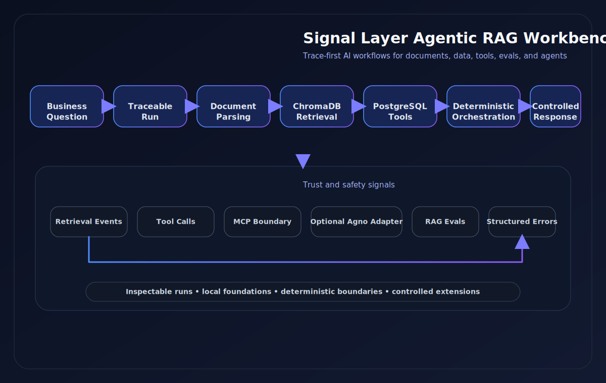
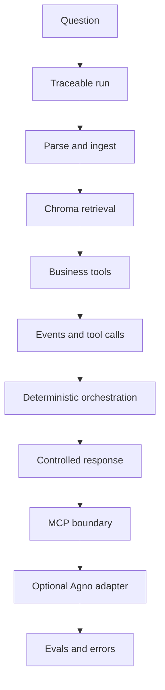

# Signal Layer Agentic RAG Workbench

A trace-first agentic RAG workbench for business data, documents, parsing,
retrieval, deterministic tools, orchestration, controlled response generation,
MCP tool exposure, deterministic evals, production hardening, and an optional
Agno adapter.

<p align="center">
  
</p>

## What this is

This project is a local engineering workbench for building and inspecting
traceable AI-assisted workflows.

It combines:

* document parsing and ingestion
* vector retrieval over document chunks
* deterministic business data tools
* traceable orchestration
* controlled response generation
* local MCP tool exposure
* deterministic evals
* operational hardening with budgets, timing, and structured errors

PostgreSQL stores business records and audit events. ChromaDB stores document
chunks and retrieval data.

## Why this exists

Most AI demos stop at:

```text
prompt → response
```

This project explores a more inspectable pattern:

```text
business question
→ traceable run
→ document retrieval
→ structured data tools
→ audit events
→ deterministic orchestration
→ future agent response
```

The goal is to make agentic systems easier to inspect, test, and extend before
introducing broader autonomy or real external provider execution.

## Current capabilities

* FastAPI service layer with validated request and response schemas
* Raw-text and file-based document ingestion
* Parsing support for `.txt`, `.md`, and `.markdown`
* Reserved optional `.pdf` parser path with clear failure behavior until wired
* ChromaDB-backed document search and run-linked retrieval
* PostgreSQL-backed business tools for customer and sales queries
* Deterministic orchestration through `POST /agent/run`
* Controlled response generation through `generate_response=true`
* Provider abstraction with deterministic mock behavior by default
* Local stdio MCP server foundation with approved tool wrappers
* Deterministic evaluation through `POST /evals/run` and `scripts/run_evals.py`
* Structured production hardening with budgets, timing, and normalized errors
* Optional Agno adapter path through `POST /agent/agno/run`

## Deployment readiness

This repository includes a deployment-readiness foundation for a safe hosted
demo, but it is still a local workbench first.

* Local Docker Compose remains the main demo path.
* Hosted demo deployment is possible with explicit environment variables.
* Deployment details, health checks, and smoke validation live in
  [docs/deployment.md](docs/deployment.md).
* `ENABLE_DEMO_ENDPOINTS` is reserved for future endpoint gating and is not
  enforced by the app yet.
* Production SaaS features such as auth, tenant isolation, billing, and
  rate limiting are intentionally future work.

## Architecture diagram



For a deeper breakdown of system boundaries and flows, see
[docs/architecture.md](docs/architecture.md).

## Stack

* Python 3.12+
* FastAPI and Pydantic
* PostgreSQL 16
* ChromaDB
* SQLAlchemy 2
* Docker and Docker Compose
* pytest, ruff, and mypy

## Quickstart

Create a virtual environment and install the project:

```bash
python3.12 -m venv .venv
source .venv/bin/activate
pip install -e ".[dev]"
cp .env.example .env
```

Start the local stack:

```bash
docker compose up --build
```

When running the API outside Docker, change the database host in `.env` from
`postgres` to `localhost`, then start the API:

```bash
uvicorn app.main:app --reload
```

OpenAPI documentation is available at `http://localhost:8000/docs`.

## Environment variables

* `DATABASE_URL`: SQLAlchemy connection URL for PostgreSQL.
* `APP_HOST`: API bind host for local or hosted demo runs.
* `APP_PORT`: API bind port for local or hosted demo runs.
* `APP_ENV`: runtime environment name.
* `DEPLOYMENT_MODE`: deployment profile, such as `local` or `hosted`.
* `CORS_ALLOWED_ORIGINS`: CORS allowlist, `*` for local development.
* `ENABLE_DOCS`: enables Swagger/OpenAPI docs.
* `ENABLE_DEMO_ENDPOINTS`: reserved hosted-demo hardening flag for future
  endpoint gating.
* `LOG_LEVEL`: application logging level.
* `CHROMA_HOST`: ChromaDB host.
* `CHROMA_PORT`: ChromaDB port.
* `CHROMA_COLLECTION`: ChromaDB collection name for document chunks.
* `EMBEDDING_PROVIDER`: embedding provider name. The current implementation uses `mock`.
* `LLM_PROVIDER`: response-generation provider. Defaults to `mock`.
* `LLM_MODEL`: response-generation model name.
* `LLM_API_KEY`: optional shared API key field for provider setup.
* `OPENAI_API_KEY`: optional provider-specific API key.
* `GEMINI_API_KEY`: optional provider-specific API key.
* `DEEPSEEK_API_KEY`: optional provider-specific API key.
* `CHUNK_SIZE`: maximum chunk size for raw text ingestion.
* `CHUNK_OVERLAP`: overlap size between adjacent text chunks.
* `REQUEST_TIMEOUT_SECONDS`: request-level operational timeout budget.
* `TOOL_TIMEOUT_SECONDS`: per-tool operational timeout budget.
* `LLM_TIMEOUT_SECONDS`: response-generation timeout budget.
* `MAX_TOOL_CALLS_PER_RUN`: maximum allowed tool calls in one orchestration run.
* `MAX_RETRIEVAL_RESULTS`: maximum retrieval results returned by one query.
* `MAX_EVAL_CASES`: maximum eval cases allowed in one eval run.
* `AGNO_ENABLED`: enables the optional Agno adapter layer.
* `AGNO_MODEL`: configured model label for the Agno path.
* `AGNO_ALLOW_REAL_PROVIDER`: keeps real model-backed Agno execution disabled by default.

## Demo scenario

The recommended local walkthrough is “Commercial policy and online sales
review.”

Use the bundled sample file:

* [samples/commercial_policy.md](samples/commercial_policy.md)

For a client-friendly overview, see [docs/demo.md](docs/demo.md). For the
step-by-step command walkthrough, see [docs/demo-script.md](docs/demo-script.md).

### Demo quick flow

1. Start services:

```bash
docker compose up --build
```

2. Seed business data:

```bash
docker compose exec api python scripts/seed_business_data.py
```

3. Parse and ingest the sample document:

```bash
curl -X POST http://localhost:8000/documents/parse-ingest \
  -F 'file=@samples/commercial_policy.md;type=text/markdown' \
  -F 'metadata={"department":"growth","document_type":"policy"}'
```

4. Search for discount approval rules:

```bash
curl -X POST http://localhost:8000/documents/search \
  -H "Content-Type: application/json" \
  -d '{
    "query": "discount approval rules",
    "limit": 5,
    "where": {
      "department": "growth"
    }
  }'
```

5. Run deterministic orchestration:

```bash
curl -X POST http://localhost:8000/agent/run \
  -H "Content-Type: application/json" \
  -d '{
    "business_question": "Analyze online sales performance and find relevant commercial policy context.",
    "retrieval_query": "discount approval rules",
    "sales_region": "east",
    "sales_channel": "online",
    "customer_segment": "enterprise"
  }'
```

6. Run controlled response generation:

```bash
curl -X POST http://localhost:8000/agent/run \
  -H "Content-Type: application/json" \
  -d '{
    "business_question": "Analyze online sales performance and find relevant commercial policy context.",
    "retrieval_query": "discount approval rules",
    "sales_region": "east",
    "sales_channel": "online",
    "customer_segment": "enterprise",
    "generate_response": true
  }'
```

7. Run the optional Agno adapter path:

```bash
curl -X POST http://localhost:8000/agent/agno/run \
  -H "Content-Type: application/json" \
  -d '{
    "business_question": "Analyze online sales performance and retrieve relevant commercial policy context.",
    "retrieval_query": "discount approval rules",
    "sales_region": "east",
    "sales_channel": "online",
    "customer_segment": "enterprise",
    "generate_response": true,
    "use_agno_agent": true
  }'
```

8. Run deterministic evals:

```bash
python scripts/run_evals.py
```

The built-in eval runner is intended for local and demo use. It ingests
built-in eval documents into the local retrieval/vector store.

9. Trigger a structured error example:

```bash
curl -X POST http://localhost:8000/documents/search \
  -H "Content-Type: application/json" \
  -d '{
    "query": "discount approval rules",
    "limit": 20
  }'
```

## Core API examples

Ingest raw text:

```bash
curl -X POST http://localhost:8000/documents/ingest \
  -H "Content-Type: application/json" \
  -d '{
    "title": "Commercial Policy",
    "source": "commercial_policy.md",
    "content": "Discount approval rules require manager review.",
    "metadata": {
      "department": "growth",
      "document_type": "policy"
    }
  }'
```

Search indexed chunks:

```bash
curl -X POST http://localhost:8000/documents/search \
  -H "Content-Type: application/json" \
  -d '{
    "query": "discount approval rules",
    "limit": 5,
    "where": {
      "department": "growth"
    }
  }'
```

Link retrieval to an existing run:

```bash
curl -X POST http://localhost:8000/runs/<run_id>/retrieve \
  -H "Content-Type: application/json" \
  -d '{
    "query": "What discount approval rules are relevant?",
    "limit": 5
  }'
```

Parse a document without ingesting it:

```bash
curl -X POST http://localhost:8000/documents/parse \
  -F 'file=@samples/commercial_policy.md;type=text/markdown' \
  -F 'metadata={"department":"growth"}'
```

Parse and ingest a document:

```bash
curl -X POST http://localhost:8000/documents/parse-ingest \
  -F 'file=@samples/commercial_policy.md;type=text/markdown' \
  -F 'metadata={"department":"growth"}'
```

Query customers:

```bash
curl -X POST http://localhost:8000/business/customers/query \
  -H "Content-Type: application/json" \
  -d '{
    "run_id": "<run_id>",
    "segment": "enterprise",
    "region": "east"
  }'
```

Summarize sales:

```bash
curl -X POST http://localhost:8000/business/sales/summary \
  -H "Content-Type: application/json" \
  -d '{
    "run_id": "<run_id>",
    "channel": "online"
  }'
```

## MCP server

Run the local stdio MCP server:

```bash
python -m app.mcp.server
```

It exposes these approved tools:

* `query_customers`
* `summarize_sales`
* `run_traceable_workflow`

This is a local stdio foundation. It reuses the existing deterministic service
layer and does not expose raw SQL, shell execution, or unrestricted tool use.

## Agno adapter

The deterministic `POST /agent/run` endpoint remains the reliability baseline.
`POST /agent/agno/run` is an optional controlled adapter path over approved
allowlisted tools and the existing trace-first flow.

Agent-facing allowlisted tools in this foundation are:

* `retrieve_documents`
* `query_customers`
* `summarize_sales`

The internal trace-first adapter path still reuses the existing
`AgentOrchestrator`. `run_traceable_workflow` remains internal adapter behavior
and is not exposed as an unrestricted model-controlled tool.

## RAG evaluation

Run the built-in eval script:

```bash
python scripts/run_evals.py
```

Run the same eval suite through the API:

```bash
curl -X POST http://localhost:8000/evals/run
```

The evaluation flow is deterministic and intended for local validation and demo
use.

## Production hardening

The current foundation includes:

* normalized application errors
* request, retrieval, and tool-call budgets
* timing and latency capture
* provider normalization
* structured MCP error envelopes

These features are designed to keep traces inspectable when failures occur.

## Quality gates

```bash
ruff check .
pytest
mypy app
docker compose config
```

Current validation:

* Ruff: passing
* Pytest: 105 tests passing
* Mypy: no issues in application code
* Docker Compose config: valid

## Current scope

This phase supports raw text and supported local file parsing, deterministic
retrieval, allowlisted business tools, explicit orchestration, controlled
response generation, local MCP exposure, deterministic evals, and a controlled
optional Agno adapter path. It does not add unrestricted autonomous tool
selection, cloud deployment, remote MCP transport, or real external provider
execution by default.

## Future extensions

See [docs/future-extensions.md](docs/future-extensions.md) for grouped
directional future work across retrieval, providers, evaluation, agent layers,
and operations.

## License

No open-source license has been added yet.
