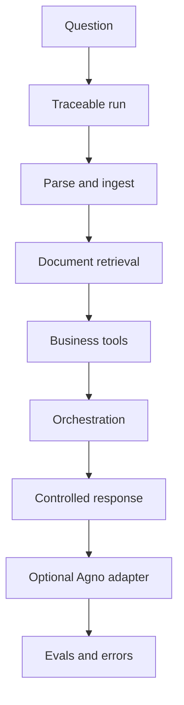

# Demo overview

This project is a local workbench foundation for traceable document retrieval,
business data access, deterministic orchestration, controlled response
generation, and inspection-friendly AI workflow development.

It is designed to show how a system can stay understandable while still
supporting richer retrieval and tool-driven flows.

## The problem

Many AI demos show only a prompt and a final answer. That makes it hard to
understand:

* what information was retrieved
* which approved tools were used
* what was stored as trace data
* how much behavior was deterministic versus model-controlled

This workbench focuses on making those steps visible.

## The workflow



## What gets traced

The workbench can record:

* run creation and completion state
* document retrieval inputs and returned chunks
* structured business tool calls
* generated response output
* deterministic eval results
* structured operational errors

This makes it easier to inspect how an answer was assembled.

## What is safe and controlled

The current foundation intentionally keeps strong boundaries:

* business tools are allowlisted and deterministic
* retrieval runs through a defined parsing, chunking, and vector path
* local MCP exposure wraps approved service-layer operations only
* the provider abstraction defaults to deterministic mock behavior
* the Agno path is optional and controlled

The system does not accept raw SQL, does not execute shell commands on behalf
of models, and does not expose unrestricted tool execution.

## What is intentionally not included

This is a local workbench foundation, not a full production platform.

It intentionally does not include:

* frontend application work
* deployment automation
* authentication and permissioning
* remote MCP transport
* real provider-backed execution as the default path
* real model-backed Agno execution
* unrestricted autonomous tool selection

## Local demo scenario

The recommended scenario is:

“Commercial policy and online sales review”

The flow is:

1. Parse and ingest a sample Markdown policy document.
2. Search for discount approval rules.
3. Run deterministic orchestration.
4. Run controlled response generation.
5. Run the optional Agno adapter endpoint.
6. Run deterministic evals.
7. Trigger a structured error example.

Use the sample document at
[samples/commercial_policy.md](../samples/commercial_policy.md).

## How to run a local demo

Start the local stack:

```bash
docker compose up --build
```

Seed the business dataset:

```bash
docker compose exec api python scripts/seed_business_data.py
```

Parse and ingest the sample Markdown document:

```bash
curl -X POST http://localhost:8000/documents/parse-ingest \
  -F 'file=@samples/commercial_policy.md;type=text/markdown' \
  -F 'metadata={"department":"growth","document_type":"policy"}'
```

Search for the approval rule:

```bash
curl -X POST http://localhost:8000/documents/search \
  -H "Content-Type: application/json" \
  -d '{
    "query":"discount approval rules",
    "limit":5,
    "where":{"department":"growth"}
  }'
```

Run deterministic orchestration:

```bash
curl -X POST http://localhost:8000/agent/run \
  -H "Content-Type: application/json" \
  -d '{
    "business_question":"Analyze online sales performance and find relevant commercial policy context.",
    "retrieval_query":"discount approval rules",
    "sales_region":"east",
    "sales_channel":"online",
    "customer_segment":"enterprise"
  }'
```

Run controlled response generation:

```bash
curl -X POST http://localhost:8000/agent/run \
  -H "Content-Type: application/json" \
  -d '{
    "business_question":"Analyze online sales performance and find relevant commercial policy context.",
    "retrieval_query":"discount approval rules",
    "sales_region":"east",
    "sales_channel":"online",
    "customer_segment":"enterprise",
    "generate_response":true
  }'
```

Run the optional Agno adapter path:

```bash
curl -X POST http://localhost:8000/agent/agno/run \
  -H "Content-Type: application/json" \
  -d '{
    "business_question":"Analyze online sales performance and retrieve relevant commercial policy context.",
    "retrieval_query":"discount approval rules",
    "sales_region":"east",
    "sales_channel":"online",
    "customer_segment":"enterprise",
    "generate_response":true,
    "use_agno_agent":true
  }'
```

Run the built-in eval suite:

```bash
python scripts/run_evals.py
```

The built-in eval runner is intended for local and demo use and ingests
built-in eval documents into the local retrieval/vector store.

Trigger a structured error example:

```bash
curl -X POST http://localhost:8000/documents/search \
  -H "Content-Type: application/json" \
  -d '{"query":"discount approval rules","limit":20}'
```

For the full command-oriented walkthrough, see
[docs/demo-script.md](demo-script.md).
